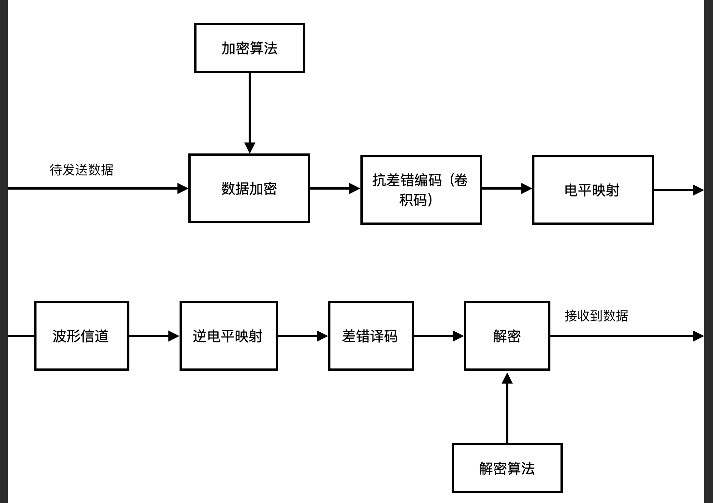

# 编码引论第二次大作业实验报告
*小组成员：马泽余 陈森睿 秦达飞*

*本部分撰写人：秦达飞*

*主要内容：从数据到电平映射处理、整体加密设计*
## 摘要

整个传输系统结构如下：

其中抗差错编码部分已经在上次作业中解决，本部分主要设计对称加密、解密模块、数据加密算法和电平映射部分。

## 对称加密--AES

本次实验的对称加密采用AES算法。按照密钥长度的不同，AES算法会对明文做多轮加密，其中，每一轮的操作如下：
1. 字节代换:对每个字节，按字节进行可逆变换。具体的，记该轮明文为$m$，则字节代换后的符号为$c = m^{-1}G_1 + b$，在实际算法设计中，只需要建立S表，每次代换进行查表操作即可。
2. 行移位：对4x4字节矩阵第$i$行进行左移$i - 1$位操作。
3. 列混淆：对行移位后的矩阵(在$GF(2^8)$)上左乘一个固定的矩阵：

$$\left[\begin{matrix}
    2&3&1&1\\
    1&2&3&1\\
    1&1&2&3\\
    3&1&1&2
\end{matrix}\right]$$
4. 轮密钥加。对于4x4矩阵的每一位和该轮对轮密钥进行逐比特亦或。

### 密钥生成算法
三种AES加密的轮数和密钥长度如下：

AES|密钥长度|加密轮数
---|---|---
AES-128|128|10
AES-192|192|12
AES-256|256|14

对于每轮加密，都需要128比特长的密钥。所以需要设计密钥生成算法。

以AES-128为例，先将16字节的密钥按列放入4x4矩阵，矩阵从左到右每一列记为$W[0], W[1], W[2], W[3]$。接着，对W数组扩充40个新列，构成总共44列的扩展密钥数组。新列以如下的递归方式产生： 
1. 如果i不是4的倍数，那么第i列由如下等式确定： 
$$W[i]=W[i-4]\oplus W[i-1] $$
2. 如果i是4的倍数，那么第i列由如下等式确定： 
$$W[i]=W[i-4]\oplus T(W[i-1]) $$

其中$T()$由三个步骤组成：
1. 字循环：将1个字中的4个字节循环左移1个字节。即将输入字$[b_0, b_1, b_2, b_3]$变换成$[b_1,b_2,b_3,b_0]$
2. 字节代换。
3. 轮常量异或：将前两步的结果同轮常量$Rcon[j]$进行异或，其中$j$表示轮数。

$$Rcon = \left[\begin{matrix}
    1&0&0&0\\
    2&0&0&0\\
    4&0&0&0\\
    8&0&0&0\\
    16&0&0&0\\
    32&0&0&0\\
    64&0&0&0\\
    128&0&0&0\\
    27&0&0&0\\
    54&0&0&0\\
\end{matrix}\right]$$
### AES解密

由于AES加密中的每一步都是可逆的，所以AES解密的步骤和加密基本一致，只不过：
1. 字节代换时采用逆S表。
2. 列混淆时左乘的矩阵为：
   $$\left[\begin{matrix}
       14&11&13&9\\
       9&14&11&13\\
       13&9&14&11\\
       11&13&9&14
   \end{matrix}\right]$$
----
## 电平映射
    
对于1,2,3,4比特的电平映射，分别采用BPSK,4QAM,8PSK,16QAM进行电平调制。

----
## 整体加密设计

我们的非对称加密采用的是椭圆曲线算法，其接受每块明文长度为240，输出每块密文长度为514。对称加密采用的是AES算法，接受的每块明文长度为128，输出每块密文长度为128。考虑到非对称加密耗时、效率低，我们选择用非对称加密算法加密AES密钥，作为包头；用对称加密算法加密数据，再将二者合并，作为发送数据。

实际调试中发现，卷积编码会改变加密后的数据长度，使得AES解密时出错，于是我们在包头中再加入实际发送的数据长度。

具体的，本次任务实际要求传送8kb信息。采用AES-192进行对称加密，AES密钥为192比特。数据长度可以用一个13位比特串表示。将AES密钥和数据长度放在一起，一共205个比特，进行非对称加密，得到514比特。再将剩下的8kb信息按照128位对齐，进行对称加密，得到8064个比特。所以，总共要发送的信息为8578个比特。

----

## 加密+卷积+波形信道联调

根据陈森睿的仿真，在高信噪比的情况下采用QPSK + 1/2卷积作为信道编码方案。对比分析加密和不加密两种情况下的误比特率曲线：

## 实验收获

https://blog.csdn.net/qq_28205153/article/details/55798628

