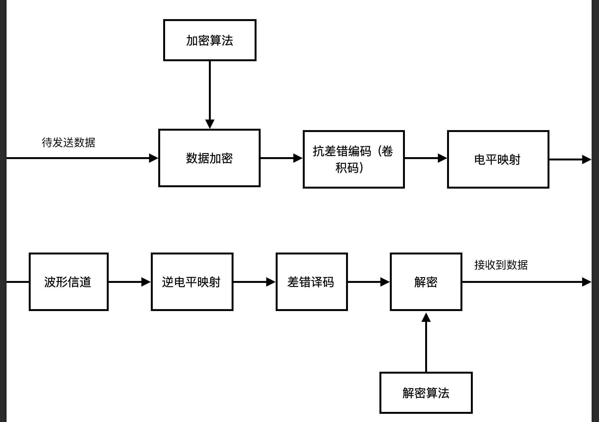
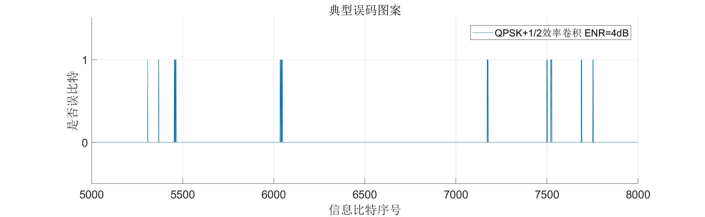
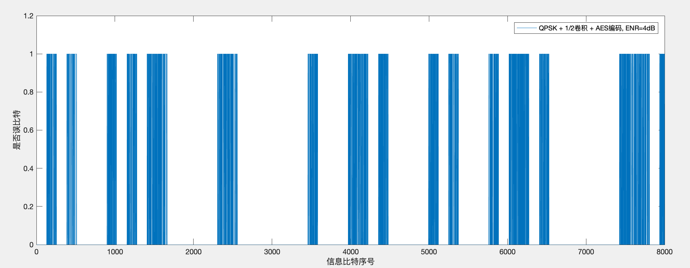

# 编码引论第二次大作业实验报告
*小组成员：马泽余 陈森睿 秦达飞*

*本部分撰写人：秦达飞*

*主要内容：从数据到电平映射处理、AES加密、整体加密设计*


## 整体概括

本次实验中，我们完成了一个带通AGWN信道中的完整通信系统，支持安全编码和各种参数的卷积编码。我们对此通信系统做了完善的理论与仿真分析。

系统框图如下：

整个传输系统结构如下：



我们的主要工作包括以下内容：

| 工作               | 说明                                                         | 负责人   |
| ------------------ | ------------------------------------------------------------ | -------- |
| 椭圆曲线非对称加密 |  参照secp256k1的标准，实现了256bit质数的高精度运算椭圆曲线加密，将信息映射到椭圆曲线的点上进行加密，可随机生成小于基点阶数的足够多秘钥                                                            | 马泽余   |
| AES对称加密        |  基于AES标准实现了AES-128、AES-192、AES-256对称加密，并结合已有C代码进行了加速。                                                            | 秦达飞   |
| 电平信道设计       | 基于第一次作业的电平信道进行修改，设计适合于波形信道的接口，负责完成电平调制解调、卷积码编译码等。 | 秦达飞   |
| 波形信道设计与仿真 | 设计AWGN波形信道，包括计算编码参数、编写信道函数、仿真获得信号波形、功率谱等。 | 陈森睿   |
| 系统联调           |  在无加密的情况下找到了最好的信道调制方式；给出了整体系统设计，完成了安全传输任务。                                                            | 全员参与 |

其中卷积码部分已经在上次作业中解决，本部分主要设计对称加密、解密模块、数据加密算法和电平映射部分。



## 对称加密--AES

本次实验的对称加密采用AES算法。按照密钥长度的不同，AES算法会对明文做多轮加密，其中，每一轮的操作如下：
1. 字节代换:对每个字节，按字节进行可逆变换。具体的，记该轮明文为$m$，则字节代换后的符号为$c = m^{-1}G_1 + b$，在实际算法设计中，只需要建立S表，每次代换进行查表操作即可。

2. 行移位：对4x4字节矩阵第$i$行进行左移$i - 1$位操作。实际计算时为了加速，直接将移位前后的位置写死。
3. 列混淆：对行移位后的矩阵(在$GF(2^8)$)上左乘一个固定的矩阵。注意到$GF(2^8)$上的乘法为乘2运算和异或运算的组合。

$$\left[\begin{matrix}
    2&3&1&1\\
    1&2&3&1\\
    1&1&2&3\\
    3&1&1&2
\end{matrix}\right]$$

```matlab
function out = mix_columns(in, s)
% Each column of the state is multiplied with a fixed polynomial mod_pol

% Each mix_col* is initialized by the `aesinit` function
out = bitxor(bitxor(bitxor([in(3,1:4); in(1,1:4); in(1,1:4); in(2,1:4)],[in(4,1:4); in(4,1:4); in(2,1:4); in(3,1:4)]),[s.mix_col2(in(1,1:4) + 1); s.mix_col2(in(2,1:4) + 1); s.mix_col2(in(3,1:4) + 1); s.mix_col3(in(1,1:4) + 1)]),[s.mix_col3(in(2,1:4) + 1); s.mix_col3(in(3,1:4) + 1); s.mix_col3(in(4,1:4) + 1); s.mix_col2(in(4,1:4) + 1)]);
```
4. 轮密钥加。对于4x4矩阵的每一位和该轮对轮密钥进行逐比特亦或。


### 密钥生成算法
三种AES加密的轮数和密钥长度如下：

AES|密钥长度|加密轮数
---|---|---
AES-128|128|10
AES-192|192|12
AES-256|256|14

对于每轮加密，都需要128比特长的密钥。所以需要设计密钥生成算法。

以AES-128为例，先将16字节的密钥按列放入4x4矩阵，矩阵从左到右每一列记为$W[0], W[1], W[2], W[3]$。接着，对W数组扩充40个新列，构成总共44列的扩展密钥数组。新列以如下的递归方式产生： 
1. 如果i不是4的倍数，那么第i列由如下等式确定： 
$$W[i]=W[i-4]\oplus W[i-1] $$
2. 如果i是4的倍数，那么第i列由如下等式确定： 
$$W[i]=W[i-4]\oplus T(W[i-1]) $$

其中$T()$由三个步骤组成：
1. 字循环：将1个字中的4个字节循环左移1个字节。即将输入字$[b_0, b_1, b_2, b_3]$变换成$[b_1,b_2,b_3,b_0]$
2. 字节代换。
3. 轮常量异或：将前两步的结果同轮常量$Rcon[j]$进行异或，其中$j$表示轮数。

$$Rcon = \left[\begin{matrix}
    1&0&0&0\\
    2&0&0&0\\
    4&0&0&0\\
    8&0&0&0\\
    16&0&0&0\\
    32&0&0&0\\
    64&0&0&0\\
    128&0&0&0\\
    27&0&0&0\\
    54&0&0&0\\
\end{matrix}\right]$$

```matlab
function expkey = key_expansion(key, s_box, rounds, mod_pol, aes_logt, aes_ilogt)
% Expansion of key
rcon = 1;
kcol = length(key)/4;
expkey = (reshape(key,4,kcol))';
for i = kcol:(4*(rounds + 1) - 1)
    temp = expkey(i, :);
    if (mod(i, kcol) == 0)
        % rotate
        temp = temp([2 3 4 1]);
        % s-box 
        temp = s_box(temp + 1);
        % xor
        temp(1) = bitxor(temp(1), rcon);
        rcon = poly_mult(rcon, 2, mod_pol);
    else
        if ((kcol > 6) && (mod(i, kcol) == 4))
            temp = s_box(temp + 1);
        end
    end
    expkey(i + 1, :) = bitxor(expkey(i - kcol + 1, :), temp);
end
```
### AES解密

由于AES加密中的每一步都是可逆的，所以AES解密的步骤和加密基本一致，只不过：
1. 字节代换时采用逆S表。
2. 列混淆时左乘的矩阵为：
   $$\left[\begin{matrix}
       14&11&13&9\\
       9&14&11&13\\
       13&9&14&11\\
       11&13&9&14
   \end{matrix}\right]$$
----
## 电平映射
    
对于1,2,3,4比特的电平映射，分别采用BPSK,4QAM,8PSK,16QAM进行电平调制。
```matlab
function out = generate2d(symbol, bits)
    % symbol: input logical bits
    % bits = 1 ->BPSK, bits = 2 ->4QAM, bits = 3 ->8PSK, bits = 4 - > 16QAM
    % out: output symbols
    if bits == 1
        V = {[-1, 0], [1, 0]};
    end

    if bits == 2
        V = {[1, 1] ./ sqrt(2), [1, -1] ./ sqrt(2), [-1, 1] ./ sqrt(2), [-1, -1] ./ sqrt(2)};
    end

    if bits == 3
        V = {[real(exp(j * 5 * pi / 8)), imag(exp(j * 5 * pi / 8))],
        [real(exp(j * 3 * pi / 8)), imag(exp(j * 3 * pi / 8))],
        [real(exp(j * 15 * pi / 8)), imag(exp(j * 15 * pi / 8))],
        [real(exp(j * 1 * pi / 8)), imag(exp(j * 1 * pi / 8))],
        [real(exp(j * 7 * pi / 8)), imag(exp(j * 7 * pi / 8))],
        [real(exp(j * 9 * pi / 8)), imag(exp(j * 9 * pi / 8))],
        [real(exp(j * 13 * pi / 8)), imag(exp(j * 13 * pi / 8))],
        [real(exp(j * 11 * pi / 8)), imag(exp(j * 11 * pi / 8))]};
    end

    if bits == 4
        V = {[3, 3] ./ sqrt(10), [3, 1] ./ sqrt(10), [3, -1] ./ sqrt(10), [3, -3] ./ sqrt(10), [1, -3] ./ sqrt(10), [-1, -3] ./ sqrt(10), [-3, -3] ./ sqrt(10), [-3, -1] ./ sqrt(10), [-3, 1] ./ sqrt(10), [-3, 3] ./ sqrt(10), [-1, 3] ./ sqrt(10), [1, 3] ./ sqrt(10), [1, 1] ./ sqrt(10), [1, -1] ./ sqrt(10), [-1, -1] ./ sqrt(10), [-1, 1] ./ sqrt(10)};
    end

    out = V{symbol + 1};
    out = out(1) + 1j * out(2);
end

```
----
## 整体加密设计

 我们的非对称加密采用的是椭圆曲线算法，其接受每块明文长度为240，输出每块密文长度为514。对称加密采用的是AES-192算法，接受的每块明文长度为128，输出每块密文长度为128,可选择的密钥数为$2^{192}$个。考虑到非对称加密耗时、效率低，我选择用非对称加密算法加密AES的密钥，作为数据包头；用对称加密算法加密数据，再将二者合并，作为发送数据。

实际调试中发现，卷积编码会改变加密后的数据长度，在实际加密数据后填入1～3个不等的0，使得AES解密时出错，于是我们在包头中再加入实际发送的数据长度，从而可以保证解密出来的数据与加密前的数据完全相等。

具体的，本次任务实际要求传送8kb信息。采用AES-192进行对称加密，AES密钥为192比特。数据长度可以用一个13位比特串表示。将AES密钥和数据长度放在一起，一共205个比特，再填充35个随机比特，共24-个比特进行非对称加密，得到514比特。再将剩下的8kb信息按照128位对齐，进行对称加密，得到8064个比特。所以，总共要发送的信息为8578个比特。
```matlab
if isEncrypt
        aeskey = randi(256, 1, 24) - 1;
        header = zeros(1, 240);
        % generate header for asym encryption
        header(1:192) = bytes2bits(aeskey);
        header(193:192+13) = lenlog;
        % initialization
        init(); 
        S = aesinit(aeskey);
        [kx, ky, key] = genKey(); 
        encryptHeader = encode(header, kx, ky); 
        % aligned to 128 bits
        if mod(length(stream), 128) ~= 0
            prolix = 128 - mod(length(stream), 128);
        else
            prolix = 0;
        end
        stream = [stream, zeros(1, prolix)];
        encryptStream = zeros(1,length(stream));
        % aes encryption
        for i=1:(length(stream) / 128)
            encryptStream((i - 1)*128 + 1:i * 128) = bytes2bits(aesencrypt(S, bits2bytes(stream((i - 1)*128 + 1:i*128))));
        end
        % total encrypted stream
        encryptStream = [encryptHeader, encryptStream];
        stream = encryptStream;
    else 
        key = 0;
    end
```
接收端，先用非对称解密将包头信息解出，得到AES密钥和明文长度。再按照128位对齐的原则去掉数据密文末尾可能多出来的1～3个比特，然后进行AES解密。最后按照明文长度取明文即可。
```matlab
if key
        encryptHeader = data(1:514);
        encryptData = data(515:end);
        % first use asym decode to find aes-key and len
        header = decode(encryptHeader, key);
        aeskey = header(1:192);
        len = header(193:192+13);
        aeskey = bits2bytes(aeskey);
        % transfer logical bits to integer
        len = len * M; 
        data = zeros(1, length(encryptData));
        % initialization
        S = aesinit(aeskey);
        % aes decode
        for i=1:(length(encryptData) / 128)
            data((i - 1)*128 + 1:i * 128) = bytes2bits(aesdecrypt(S, bits2bytes(encryptData((i - 1)*128 + 1:i*128))));
        end
        data = data(1:len);
    end
```

----

## 加密+卷积+波形信道联调

这部分的任务主要有两个：
1. 对比无加密和有加密的误码图案，判断加密是否具有扩散等良好属性。
2. 找到本次试验中最优的传输方案。

根据陈森睿同学的仿真，在高信噪比的情况下采用QPSK + 1/2卷积作为信道编码方案最有效，故下述分析都基于这种信道编码。
### 误码图案对比


由于非对称编解码开销很大，故在仿真时仅考虑对称编码部分的错误。实际上，一旦非对称编码出现误码，就意味着AES密钥错误，那么所有的数据均不能解码，所以必须保证非对称密文（包头部分）要准确无误地送达。

下面画出不同信噪比情况下，无加密和使用AES加密的误码图样：

1. QPSK + 1/2效率卷积， (Eb/n0) = 4dB：


2. QPSK + 1/2效率卷积 + AES编码 + (Eb/n0) = 4dB：



对比两图得出以下结论：
1. AES加密后，错误以128比特为单位成块出现。AES加密良好地完成了错误扩散的任务。
2. 4dB的信噪比是远远不能保证无差错传输的。

### 寻找最优的传输方案

由上述实验结论可知，4dB传输无法满足要求，所以发送功率需要进一步提高。

经过漫长的仿真，直到信噪比达到8.5dB时，200次实验均可准确传输。所以我们认为，在QPSK + 1/2效率编码的情况下，8.5dB的信噪比可以保证无错误传输。


## 实验收获和总结
本次实验，我主要负责了通信系统中从数据到电平的整体设计，综合利用对称编码和非对称编码，结合同学的信道优化，较好地解决了安全传输的问题。本次实验的主要收获有一下三点：
1. 深入理解了AES加密算法和有限域上的计算。
2. 对从信源加密、信道编码、波形映射到解码的完整通信系统有了全面的认识。
3. 熟练掌握了多人协作的版本控制软件`git`。由于上次作业我们没有进行版本控制，提交报告后每个人的代码版本都不一样。这导致本次试验开始时，我花了不少时间用于梳理上次实验的遗留代码。这次实验我们吸取教训，及时同步版本，保证彼此的修改不会冲突，同时也方便以后分享和利用。

本次实验还有如下不足：
1. 如果实验允许误块，那么信噪比可以进一步降低。此时最好对包头（非对称加密部分）和对称加密部分使用安全程度不同的编码，比如前面用1/3效率卷积，后面用1/2卷积。因为包头部分携带了后面需要的解密密钥，错一点就会导致后面的信息完全解不出来；而后面的部分即使出错，也只会扩散到同一个128位块中。

## 我负责的代码
`bits2syms`:从信息比特到电平符号函数，包含加密、卷积、电平映射模块。

`syms2bits`:从电平符号反变换为信息比特的函数。

`bits2bytes`:比特序列向字节的转换函数。

`bytes2bits`：字节向比特的转换函数。
`aesinit`: AES加密预计算函数。

`aesencrypt`: AES加密函数。
`aesdecrypt`: AES解密函数。

`shift_rows`,`mix_columns`: AES模块。

`encryptSImulation`:基于陈森睿的代码设计的加密仿真模块。

## 参考文献

[AES加密算法的详细介绍与实现](https://blog.csdn.net/qq_28205153/article/details/55798628)

[Advanced Encryption Standard by Example](https://infosecwriters.com/text_resources/pdf/AESbyExample.pdf)


